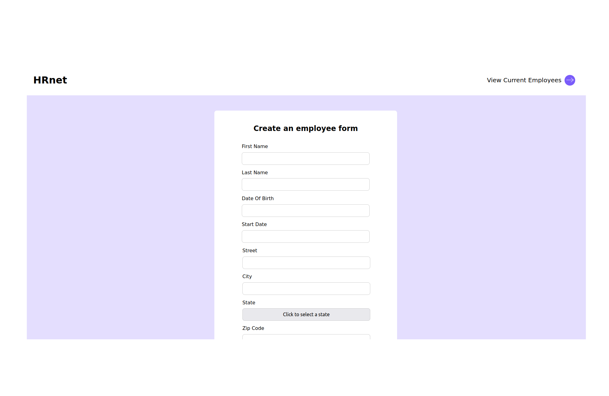

# HRnet
English version below!

WealthHealth, mon employeur, utilise une application web interne appelée HRnet qui gère les dossiers des employés. L'application est ancienne et utilise jQuery sur le front-end, ce qui entraîne des bugs considérables et une augmentation des plaintes internes.
Je suis chargé de convertir cette application en React ainsi qu'une bibliothèque jQuery.

**OBJECTIFS DU PROJET** :

- Refonte d'une application pour réduire la dette technique.
- Analyser les performances d'une application web
- Déployer une application frontale
- Programmer en JavaScript avec la programmation fonctionnelle

**Liens utiles:**

Nouvelle application :
- [Site Web 🌍](https://benjaminlesne.github.io/BenjaminLesne_14_07122021)
- [Code source 📖](https://github.com/BenjaminLesne/BenjaminLesne_14_07122021)

Application originale :
- [Site Web 🌍](https://benjaminlesne.github.io/P12_Front-end/)
- [Code source 📖](https://github.com/BenjaminLesne/P12_Front-end)

## Remarques :

J'ai fait des tests unitaires (cf dossier de chaque page) et une documentation avec JsDoc que vous pouvez trouver dans projectFolder/docs/index.html. Faites un clic droit sur ce fichier html puis "open with [live server](https://marketplace.visualstudio.com/items?itemName=ritwickdey.LiveServer)" et vous devriez voir la documentation dans votre navigateur.

Il est possible de soumettre le même formulaire à volonté, c'est intentionnel. Ca permet d'ajouter des employées plus rapidement afin de voir le résultat visuel sur la page "current employees".

# ENGLISH VERSION

WealthHealth, my employer, uses an internal web application called HRnet that manages employee records. The application is old and uses jQuery on the front end, which leads to considerable bugs and increased internal complaints.
I'm in charge of converting this application to React, with the addition of a jQuery library.

**PROJECT GOALS**:

- Redesigning an application to reduce technical debt
- Analyze the performance of a web application
- Deploying a front-end application
- Programming in JavaScript with functional programming

**Useful links:**

New App:
- [Website 🌍](https://benjaminlesne.github.io/BenjaminLesne_14_07122021)
- [Source Code 📖](https://github.com/BenjaminLesne/BenjaminLesne_14_07122021)

Original App:
- [Website 🌍](https://benjaminlesne.github.io/P12_Front-end/)
- [Source Code 📖](https://github.com/BenjaminLesne/P12_Front-end)

## Side note:

I did units tests (cf folder of each page) and a documentation with JsDoc that you can find in projectFolder/docs/index.html. Right click on this html file then "open with [live server](https://marketplace.visualstudio.com/items?itemName=ritwickdey.LiveServer)" and you should see the documentation in your browser.

It is possible to submit the same form over and over again, this is intentional. It allows you to add employees more quickly so you can see the visual result on the "current employees" page.

## Installation

- Install [yarn](https://yarnpkg.com/getting-started/install) on your system
- Clone this repository and run yarn install in your command line.
- Start the app with yarn start
- The app should now run in http://localhost:3000/

## License

This project is part of the OpenClassrooms [Front-End Developer](https://openclassrooms.com/fr/paths/314-developpeur-front-end) course. The code is freely reusable, but the images / logo / figma mock-up do not belong to me.

If you are also an OC student, you can freely draw inspiration from my work, but I obviously do not recommend copying parts of it.
